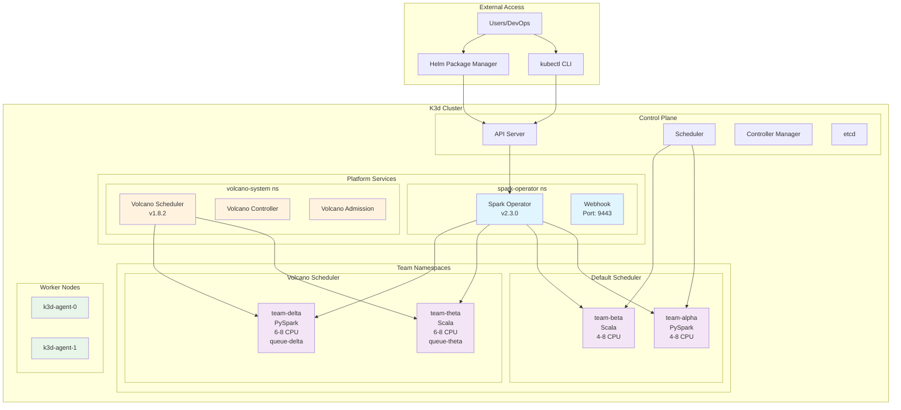
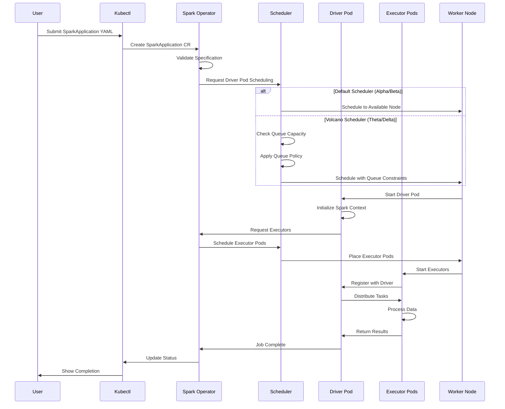
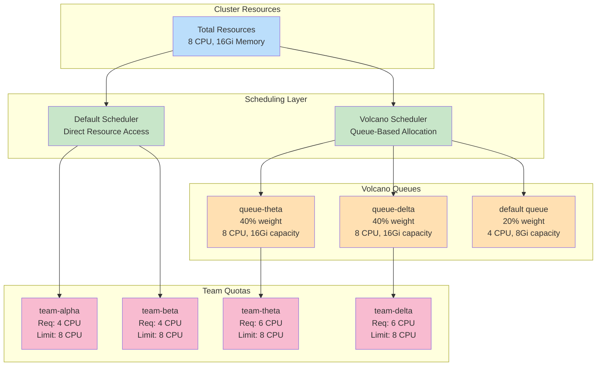
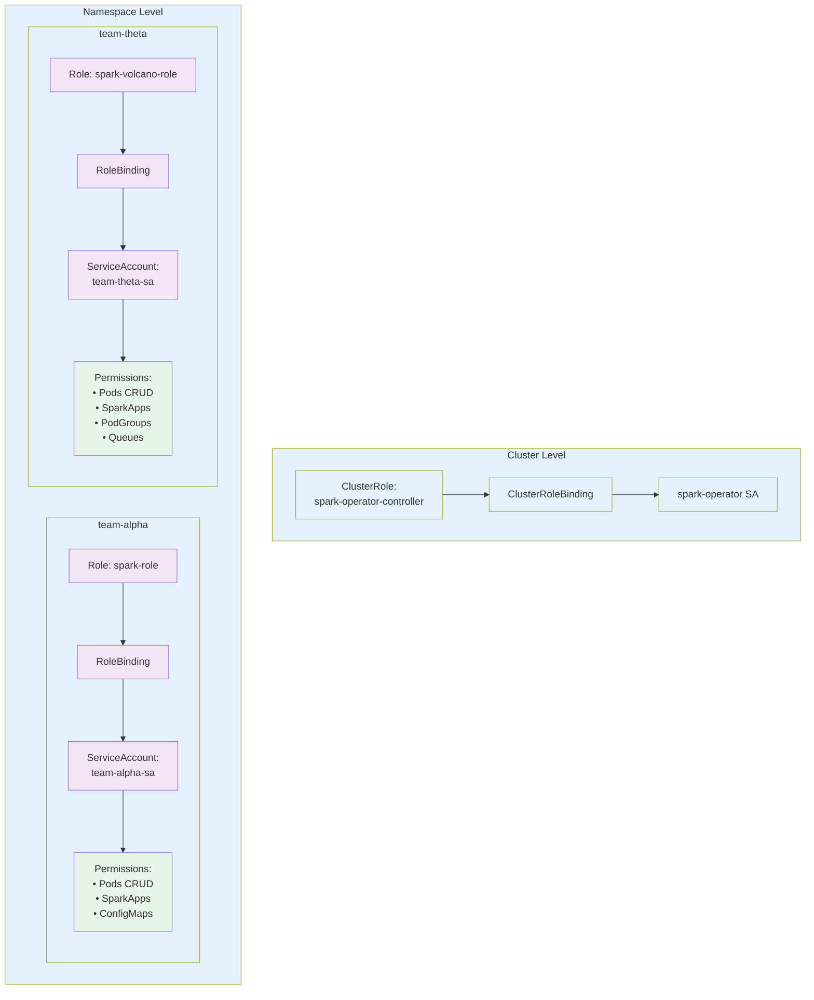
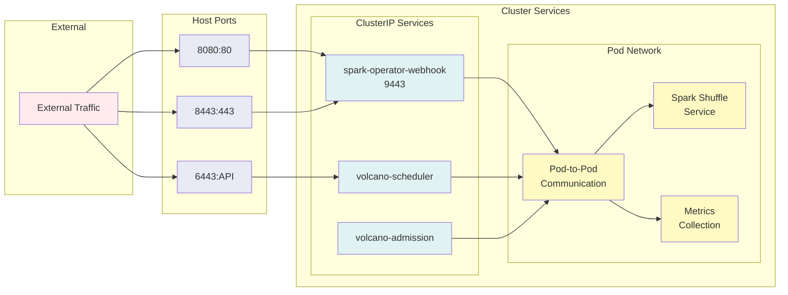
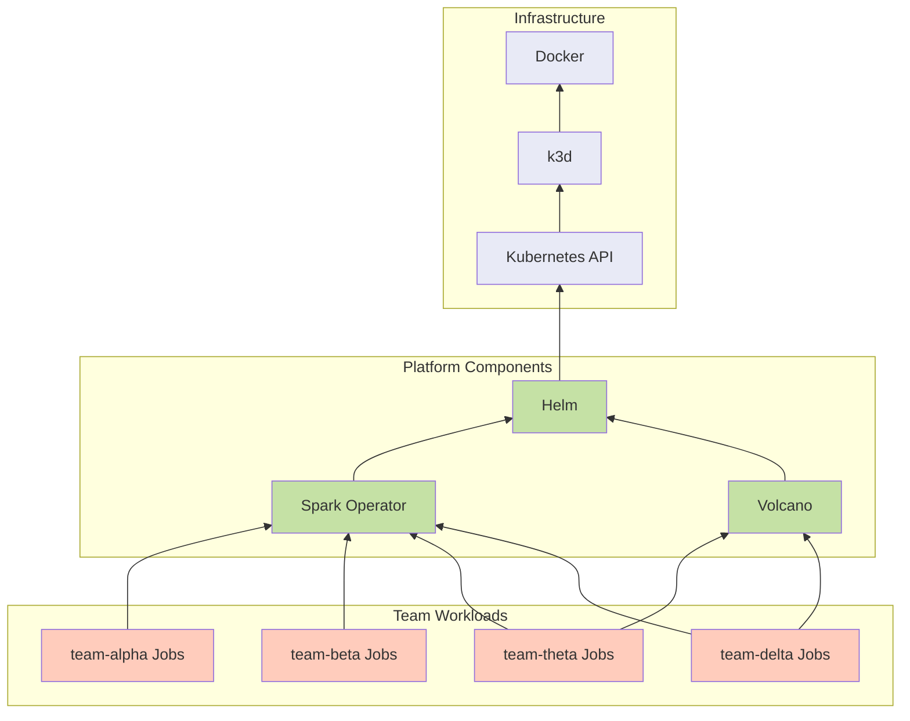
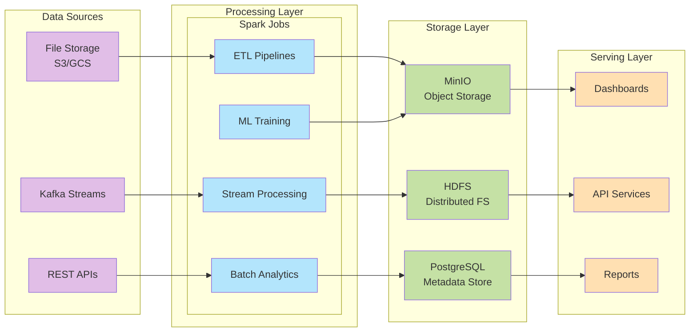

# System Architecture - Mermaid Diagrams

These diagrams can be rendered directly in GitHub or any Markdown viewer that supports Mermaid.

## Platform Overview

## Spark Job Execution Flow

## Resource Allocation Hierarchy

## Security & RBAC Model

## Network Architecture

## Component Dependencies

## Data Flow (Future State)

